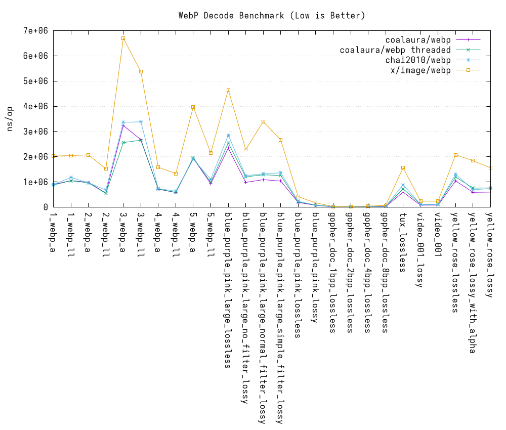

webp
=====

```
██╗    ██╗███████╗██████╗ ██████╗
██║    ██║██╔════╝██╔══██╗██╔══██╗
██║ █╗ ██║█████╗  ██████╔╝██████╔╝
██║███╗██║██╔══╝  ██╔══██╗██╔═══╝
╚███╔███╔╝███████╗██████╔╝██║
 ╚══╝╚══╝ ╚══════╝╚═════╝ ╚═╝
```


[](https://github.com/coalaura/webp/actions/workflows/test.yml)
[](https://pkg.go.dev/github.com/coalaura/webp)
[](https://github.com/coalaura/webp/releases)
[](https://github.com/coalaura/webp/blob/master/LICENSE)

Why this fork
=============

This fork adds a few practical improvements over the original repository:

- libwebp 1.6.0 instead of 1.4.0
- Animated WebP support (DecodeAll/EncodeAll)
- Full WebP config parsing (has_alpha, has_animation and format via DecodeConfigEx)
- More exposed WebP encoding options (method, auto_filter, etc.)

Benchmark
=========




Install
=======

Install Zig first (recommended, cross-platform, `export CC="zig cc" && export CXX="zig c++"`),
and then run these commands:

1. `go get github.com/coalaura/webp`
2. `go run hello.go`


Example
=======

This is a simple example:

```Go
package main

import (
	"bytes"
	"fmt"
	"log"
	"os"

	"github.com/coalaura/webp"
)

func main() {
	var buf bytes.Buffer
	var width, height int
	var data []byte
	var err error

	// Load file data
	if data, err = os.ReadFile("./testdata/1_webp_ll.webp"); err != nil {
		log.Println(err)
	}

	// GetInfo
	if width, height, _, _, _, err = webp.GetInfo(data); err != nil {
		log.Println(err)
	}
	fmt.Printf("width = %d, height = %d\n", width, height)

	// GetMetadata
	if metadata, err := webp.GetMetadata(data, "ICCP"); err != nil {
		fmt.Printf("Metadata: err = %v\n", err)
	} else {
		fmt.Printf("Metadata: %s\n", string(metadata))
	}

	// Decode webp
	m, err := webp.Decode(bytes.NewReader(data))
	if err != nil {
		log.Println(err)
	}

	// Encode lossless webp
	if err = webp.Encode(&buf, m, &webp.Options{Lossless: true}); err != nil {
		log.Println(err)
	}
	if err = os.WriteFile("output.webp", buf.Bytes(), 0666); err != nil {
		log.Println(err)
	}
    
    fmt.Println("Save output.webp ok")
}
```

Decode and Encode as RGB format:

```Go
m, err := webp.DecodeRGB(data)
if err != nil {
	log.Fatal(err)
}

data, err := webp.EncodeRGB(m)
if err != nil {
	log.Fatal(err)
}
```
