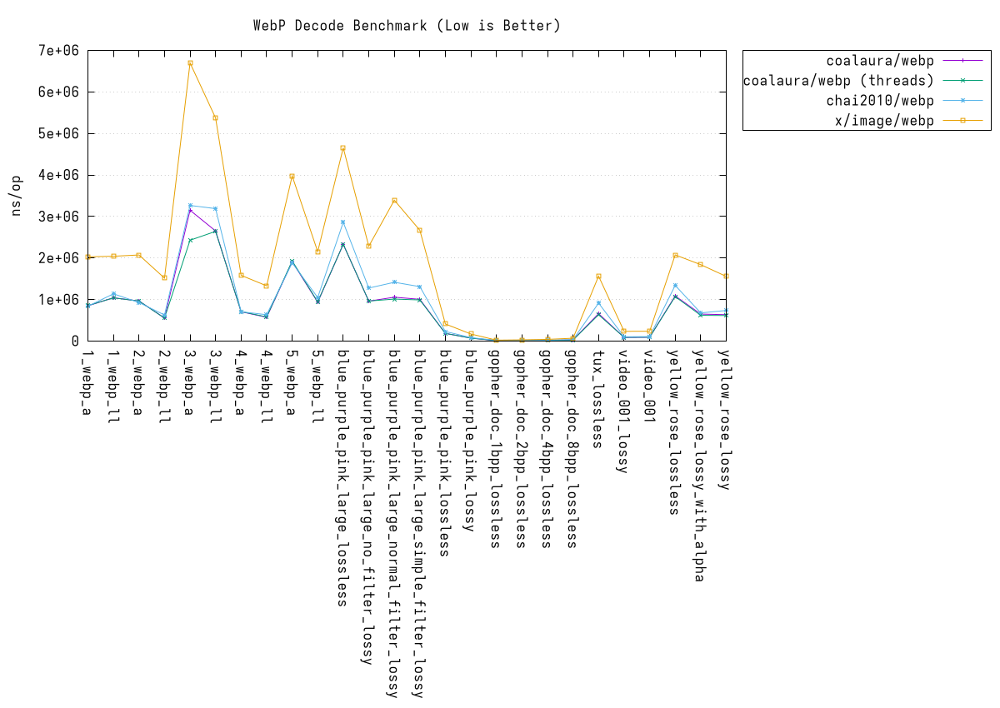
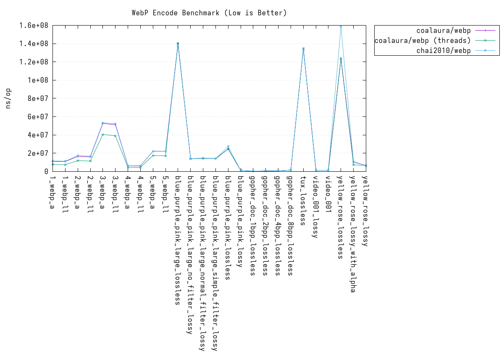

Benchmark
=========

Decode
------



Encode
------




```
go test -bench=.
goos: windows
goarch: amd64
pkg: github.com/coalaura/webp/bench
cpu: AMD Ryzen 9 9950X3D 16-Core Processor
BenchmarkDecode_1_webp_a_coalaura_webp-32                                                   1164            993058 ns/op
BenchmarkDecode_1_webp_a_x_image_webp-32                                                     579           2067563 ns/op
BenchmarkDecode_1_webp_a_coalaura_webp_tosize-32                                            1063           1117729 ns/op
BenchmarkDecode_1_webp_ll_coalaura_webp-32                                                  1029           1160950 ns/op
BenchmarkDecode_1_webp_ll_x_image_webp-32                                                    574           2071004 ns/op
BenchmarkDecode_1_webp_ll_coalaura_webp_tosize-32                                            882           1359462 ns/op
BenchmarkDecode_2_webp_a_coalaura_webp-32                                                   1003           1080472 ns/op
BenchmarkDecode_2_webp_a_x_image_webp-32                                                     574           2117701 ns/op
BenchmarkDecode_2_webp_a_coalaura_webp_tosize-32                                             918           1298951 ns/op
BenchmarkDecode_2_webp_ll_coalaura_webp-32                                                  1801            687376 ns/op
BenchmarkDecode_2_webp_ll_x_image_webp-32                                                    738           1605109 ns/op
BenchmarkDecode_2_webp_ll_coalaura_webp_tosize-32                                           1279            946807 ns/op
BenchmarkDecode_3_webp_a_coalaura_webp-32                                                    264           4452619 ns/op
BenchmarkDecode_3_webp_a_x_image_webp-32                                                     170           6871857 ns/op
BenchmarkDecode_3_webp_a_coalaura_webp_tosize-32                                             348           3447589 ns/op
BenchmarkDecode_3_webp_ll_coalaura_webp-32                                                   301           4024598 ns/op
BenchmarkDecode_3_webp_ll_x_image_webp-32                                                    212           5529149 ns/op
BenchmarkDecode_3_webp_ll_coalaura_webp_tosize-32                                            369           3227844 ns/op
BenchmarkDecode_4_webp_a_coalaura_webp-32                                                   1620            834068 ns/op
BenchmarkDecode_4_webp_a_x_image_webp-32                                                     763           1581820 ns/op
BenchmarkDecode_4_webp_a_coalaura_webp_tosize-32                                            1196            957226 ns/op
BenchmarkDecode_4_webp_ll_coalaura_webp-32                                                  1495            815909 ns/op
BenchmarkDecode_4_webp_ll_x_image_webp-32                                                    872           1391808 ns/op
BenchmarkDecode_4_webp_ll_coalaura_webp_tosize-32                                           1526            793898 ns/op
BenchmarkDecode_5_webp_a_coalaura_webp-32                                                    540           2107616 ns/op
BenchmarkDecode_5_webp_a_x_image_webp-32                                                     262           4333479 ns/op
BenchmarkDecode_5_webp_a_coalaura_webp_tosize-32                                             544           2209058 ns/op
BenchmarkDecode_5_webp_ll_coalaura_webp-32                                                   955           1510211 ns/op
BenchmarkDecode_5_webp_ll_x_image_webp-32                                                    553           2200037 ns/op
BenchmarkDecode_5_webp_ll_coalaura_webp_tosize-32                                            960           1306366 ns/op
BenchmarkDecode_blue_purple_pink_large_lossless_coalaura_webp-32                             332           3537769 ns/op
BenchmarkDecode_blue_purple_pink_large_lossless_x_image_webp-32                              252           4812931 ns/op
BenchmarkDecode_blue_purple_pink_large_lossless_coalaura_webp_tosize-32                      447           2749759 ns/op
BenchmarkDecode_blue_purple_pink_large_no_filter_lossy_coalaura_webp-32                      706           2025417 ns/op
BenchmarkDecode_blue_purple_pink_large_no_filter_lossy_x_image_webp-32                       508           2291807 ns/op
BenchmarkDecode_blue_purple_pink_large_no_filter_lossy_coalaura_webp_tosize-32               981           1295914 ns/op
BenchmarkDecode_blue_purple_pink_large_normal_filter_lossy_coalaura_webp-32                  678           2037367 ns/op
BenchmarkDecode_blue_purple_pink_large_normal_filter_lossy_x_image_webp-32                   343           3494466 ns/op
BenchmarkDecode_blue_purple_pink_large_normal_filter_lossy_coalaura_webp_tosize-32           973           1225765 ns/op
BenchmarkDecode_blue_purple_pink_large_simple_filter_lossy_coalaura_webp-32                  592           2162921 ns/op
BenchmarkDecode_blue_purple_pink_large_simple_filter_lossy_x_image_webp-32                   440           2727941 ns/op
BenchmarkDecode_blue_purple_pink_large_simple_filter_lossy_coalaura_webp_tosize-32           980           1231608 ns/op
BenchmarkDecode_blue_purple_pink_lossless_coalaura_webp-32                                  5605            252774 ns/op
BenchmarkDecode_blue_purple_pink_lossless_x_image_webp-32                                   2661            455541 ns/op
BenchmarkDecode_blue_purple_pink_lossless_coalaura_webp_tosize-32                           4039            359919 ns/op
BenchmarkDecode_blue_purple_pink_lossy_coalaura_webp-32                                    12753             91573 ns/op
BenchmarkDecode_blue_purple_pink_lossy_x_image_webp-32                                      6117            169097 ns/op
BenchmarkDecode_blue_purple_pink_lossy_coalaura_webp_tosize-32                              5340            214523 ns/op
BenchmarkDecode_gopher_doc_1bpp_lossless_coalaura_webp-32                                  51238             30632 ns/op
BenchmarkDecode_gopher_doc_1bpp_lossless_x_image_webp-32                                   44924             27800 ns/op
BenchmarkDecode_gopher_doc_1bpp_lossless_coalaura_webp_tosize-32                           10000            163263 ns/op
BenchmarkDecode_gopher_doc_2bpp_lossless_coalaura_webp-32                                  40558             30764 ns/op
BenchmarkDecode_gopher_doc_2bpp_lossless_x_image_webp-32                                   32396             34788 ns/op
BenchmarkDecode_gopher_doc_2bpp_lossless_coalaura_webp_tosize-32                            6678            182986 ns/op
BenchmarkDecode_gopher_doc_4bpp_lossless_coalaura_webp-32                                  43635             29639 ns/op
BenchmarkDecode_gopher_doc_4bpp_lossless_x_image_webp-32                                   22674             50591 ns/op
BenchmarkDecode_gopher_doc_4bpp_lossless_coalaura_webp_tosize-32                            9834            149137 ns/op
BenchmarkDecode_gopher_doc_8bpp_lossless_coalaura_webp-32                                  31570             39275 ns/op
BenchmarkDecode_gopher_doc_8bpp_lossless_x_image_webp-32                                   15531             79258 ns/op
BenchmarkDecode_gopher_doc_8bpp_lossless_coalaura_webp_tosize-32                            9517            151465 ns/op
BenchmarkDecode_photo_lossy_coalaura_webp-32                                                  36          29439494 ns/op
BenchmarkDecode_photo_lossy_x_image_webp-32                                                   14          76163329 ns/op
BenchmarkDecode_photo_lossy_coalaura_webp_tosize-32                                           60          19049302 ns/op
BenchmarkDecode_tux_lossless_coalaura_webp-32                                               1302            960729 ns/op
BenchmarkDecode_tux_lossless_x_image_webp-32                                                 680           1720514 ns/op
BenchmarkDecode_tux_lossless_coalaura_webp_tosize-32                                        1298            917767 ns/op
BenchmarkDecode_video_001_lossy_coalaura_webp-32                                           13297             91349 ns/op
BenchmarkDecode_video_001_lossy_x_image_webp-32                                             4542            234187 ns/op
BenchmarkDecode_video_001_lossy_coalaura_webp_tosize-32                                     5745            227753 ns/op
BenchmarkDecode_video_001_coalaura_webp-32                                                 12231             94136 ns/op
BenchmarkDecode_video_001_x_image_webp-32                                                   4744            240181 ns/op
BenchmarkDecode_video_001_coalaura_webp_tosize-32                                           7066            236078 ns/op
BenchmarkDecode_yellow_rose_lossless_coalaura_webp-32                                        877           1305926 ns/op
BenchmarkDecode_yellow_rose_lossless_x_image_webp-32                                         518           2202347 ns/op
BenchmarkDecode_yellow_rose_lossless_coalaura_webp_tosize-32                                 902           1342310 ns/op
BenchmarkDecode_yellow_rose_lossy_with_alpha_coalaura_webp-32                               1842            678400 ns/op
BenchmarkDecode_yellow_rose_lossy_with_alpha_x_image_webp-32                                 625           2066987 ns/op
BenchmarkDecode_yellow_rose_lossy_with_alpha_coalaura_webp_tosize-32                        1546            780081 ns/op
BenchmarkDecode_yellow_rose_lossy_coalaura_webp-32                                          1620            671038 ns/op
BenchmarkDecode_yellow_rose_lossy_x_image_webp-32                                            762           1566191 ns/op
BenchmarkDecode_yellow_rose_lossy_coalaura_webp_tosize-32                                   1658            717219 ns/op
PASS
ok      github.com/coalaura/webp/bench  119.392s
```
